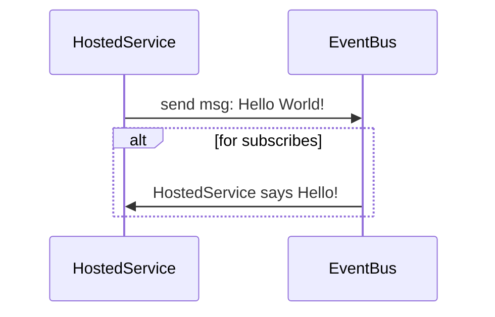

## Banco Bari Playground
> Serviço possui uma **Hosted Service** que emite uma menssagem de *Hello World* a cada 5 segundos, sendo capaz também de assinar outros eventos emitidos pelo broker. 

#### Requisitos do projeto: 
Desenvolva um micro-serviço, que envie uma mensagem de Hello Worlda cada5 segundos. Essa mensagem deve conter, além da mensagem de Hello World, um Identificador do micro-serviço, o timestamp que foi enviado, e um Id de requisição aleatório. Além disso, esse serviço deve ser capaz de ler mensagens enviadas por outros micro-serviços, mostrando na tela esses dados.

É obrigatório o uso de algum sistema de mensagens (AMQP, Kafka, JMS, etc.). Queremos rodar pelo menos duas instâncias do serviço desenvolvido e ver a comunicação entre eles.

#### Stack utilizada nese projeto:

* C# .NET CORE 3
* RABBITMQ CLIENT
* POLLY
* SERILOG + ELASTICSEARCH
* XUNIT + MOQ
* DOCKER

#### Arquitetura:
A solução do projeto possui uma arquitetura simples, conforme desmonstrado a seguir:

```bash
-> ~ tree
.
├── EventBus
│   ├── Abstractions
│   │   ├── IEventBus.cs
│   │   └── IEventHandler.cs
│   ├── Connection
│   │   ├── IRabbitMqConnection.cs
│   │   ├── RabbitMqConnection.cs
│   │   └── ResiliencePolicies
│   │       └── Policies.cs
│   ├── EventBus.cs
│   ├── Events
│   │   └── Event.cs
│   ├── ISubscriptionsManage.cs
│   ├── SubscriptionInfo.cs
│   └── SubscriptionsManager.cs
├── HostedService
│   ├── IntegrationEvents
│   │   ├── Events
│   │   │   └── HelloWorldEvent.cs
│   │   ├── Handlers
│   │   │   └── HelloWorldEventHandler.cs
│   │   ├── HostedEventService.cs
│   │   └── IHostedEventService.cs
│   ├── Program.cs
│   └── Worker.cs
└──
```
A solução possui dois projetos, o primeiro é o projeto responsavel pelo barramento de eventos que é uma abstração para que os serviços assinem, publiquem e recebam eventos do broker.

E o segundo projeto é um worker, com o .NET Core 3.0 temos um template chamado Worker Service, o qual simplifica em muito a implementação de aplicações que serão executadas como processos (Windows Services e Linux Daemons).

**Comunicação**:

Conforme acima, o barramento de eventos é uma abstração do broker, portanto todas as interação são processadas pelo o mesmo:



Foi escolhido o RabbitMq para a implementação do barramento de eventos, abaixo segue um método simples de publicação de mensagens pelo baramentos utilizando política de repetição Polly, que repete a tarefa um determinado número de vezes caso o contêiner do RabbitMq não esteja pronto

```csharp
public void Publish(Event @event) {
 if (!_connection.IsConnected) _connection.TryConnect();

 using
 var channel = _connection.CreateModel();
 var eventName = @event.GetType()
  .Name;

 channel.ExchangeDeclare(BrokerName,
  "direct");

 var message = JsonConvert.SerializeObject(@event);
 var body = Encoding.UTF8.GetBytes(message);

 Policies.WaitRetryPolicy(3).Execute(() => {
  var properties = channel.CreateBasicProperties();
  properties.DeliveryMode = 2;

  channel.BasicPublish(BrokerName,
   eventName, true,
   properties, body);
 });
}
 ```
[EventBus.cs](https://gist.github.com/gabrielesteveslima/7fdc6097e54c373099152524629726c3)

#### Rodando o projeto:

OS X & Linux:

```sh
$ sudo docker-compose up -d --build
```

#### Visualização de logs
Foram registrados logs das interações do serviço com o broker utilizando o Serilog + Elasticseach.

NOTA: O Elasticsearch usa um diretório híbrido mmapfs / niofs por padrão para armazenar seus índices. É provável que os limites padrão do sistema operacional nas contagens de mmap sejam muito baixos, o que pode resultar em exceções de falta de memória.

No Linux, você pode aumentar os limites executando o seguinte comando como root:

```sh
$ sudo sysctl -w vm.max_map_count=262144
```

Para visualização você deve acessar a interface gráfica do elasticsearch, o [Kibana](htt://127.0.0.1:5601) e deverá ser criado um *Index patterns* como **logstash-*** para visualizar os logs na seção *Discover*.

